<p align="center">
  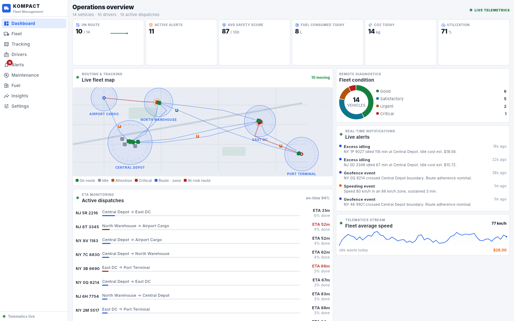
</p>

<h1 align="center">Kompact FMS</h1>

<p align="center">
  <strong>A compact-design fleet management system.</strong><br>
  7 role-based dashboards · live tracking · drivers · fuel · predictive maintenance · safety & compliance — built with Flutter for 6 targets from one codebase.
</p>

<p align="center">
  <a href="https://github.com/L3von36/kompact/actions/workflows/release.yml"></a>
  <a href="https://github.com/L3von36/kompact/releases"></a>
  
  
</p>

---

Implements the must-have feature set from the fleet-management playbook —
*driver management, routing & tracking, fuel management, predictive maintenance,
fleet safety & compliance* — on a live-simulated telematics pipeline with an
emphasis on emerging tech (IoT sensors, AI predictions, geofencing/spatial ops,
remote dashboards).

## Role-based workspaces

The same live telematics pipeline, framed for the decisions each role actually
makes. Switch workspace from the sidebar identity card (or `?role=driver` in
the web URL) — the dashboard, modules and navigation all follow the persona.

| Role | Dashboard optimizes for |
|---|---|
| **Fleet Manager** (Ops) | Total oversight — utilization, condition mix, alert feed, dispatch health, live map |
| **Dispatcher** | Load board with ETAs & at-risk flags, ready-to-dispatch vehicles with one-tap DISPATCH, driver availability with HOS remaining |
| **Driver** | Personal cockpit — current trip, HOS clocks (11h day / 70h cycle), vehicle vitals, DVIR pre-trip checklist, eco coaching |
| **Maintenance Manager** | Work-order pipeline (predicted → scheduled → in shop) with actions, worst-first health triage, active DTC codes, preventive vs corrective mix |
| **Safety & Compliance** | Driver safety leaderboard, 30-day behavior breakdown, HOS at-risk drivers, ELD connectivity, violation register with fines exposure |
| **Finance & Admin** | Fuel spend trend, cost structure, $/km blended, maintenance exposure, idle waste, IFTA quarterly estimate |
| **Executive** | Utilization heatmap, on-time delivery, cost & CO2 trends, fleet mix, strategic focus (retention / green / cost control) |

| Dispatcher | Driver cockpit |
|---|---|
| 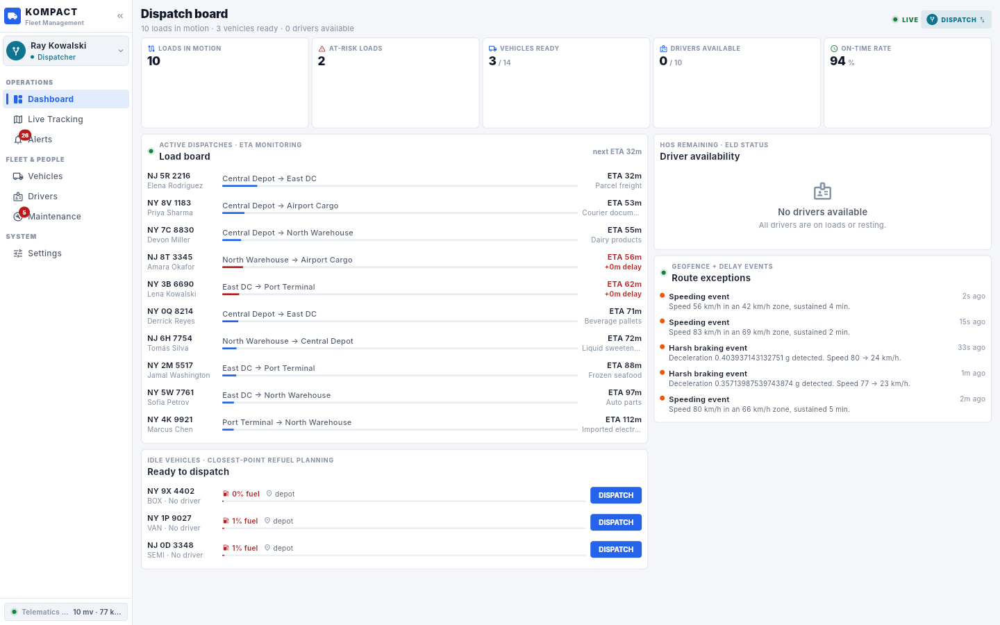 | 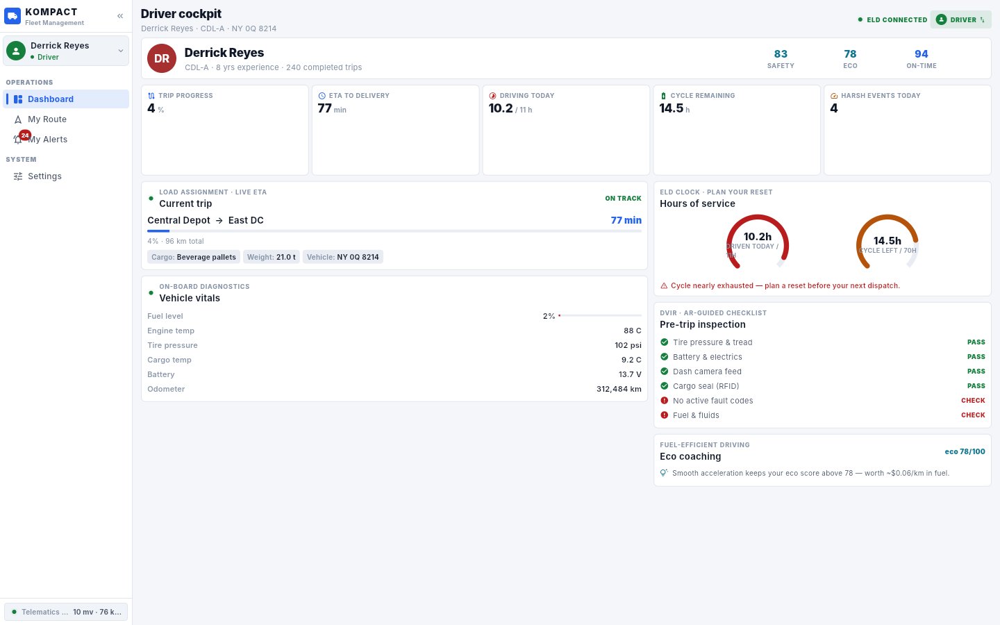 |
| **Shop overview** | **Safety & compliance** |
| 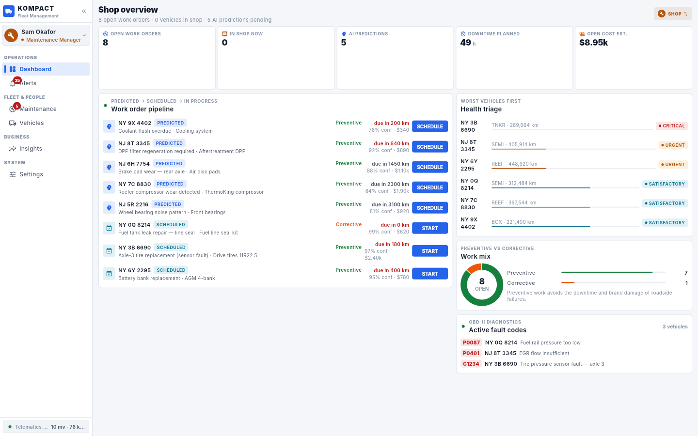 | 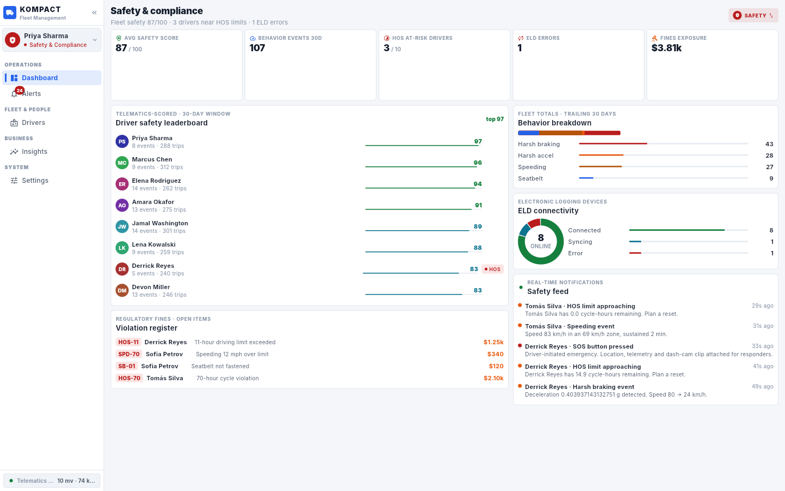 |
| **Cost center** | **Executive overview** |
| 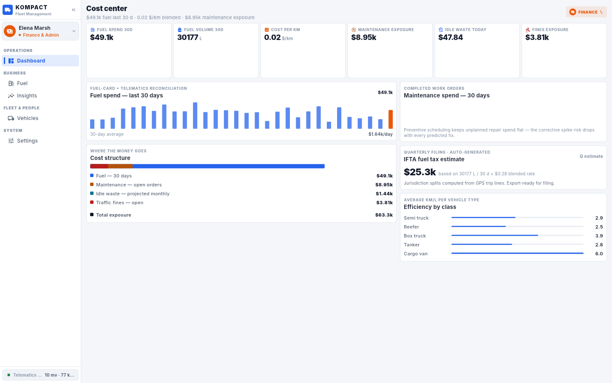 | 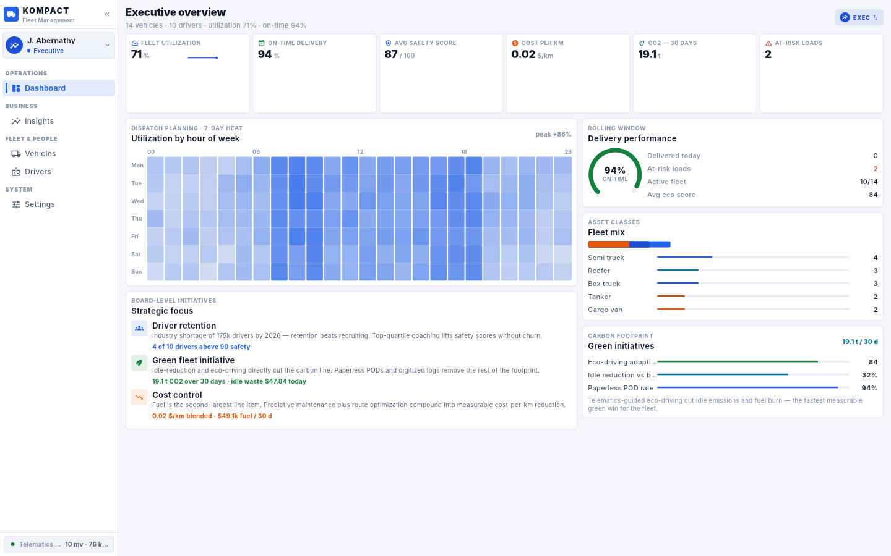 |

<details>
<summary>Driver workspace on mobile</summary>

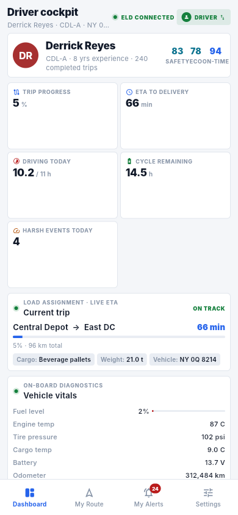
</details>

## The compact design system

Compact design = **less physical space, full functionality**. Every screen is a
dense, information-rich console:

| Principle | Implementation |
|---|---|
| **2px micro-grid** | Spacing snaps to 2 / 4 / 6 / 8 / 12 / 16 / 20 / 28 |
| **Tight type scale** | Inter: body 12px, labels 11px, 9px uppercase micro-chips |
| **Hairline over shadow** | 1px borders instead of elevation — calmer, denser surfaces |
| **Status as color + text** | Good / Satisfactory / Urgent / Critical ladder with icons — never color alone |
| **Density as a feature** | `VisualDensity.compact`, 26–32px rows, toggleable |
| **Adaptive shell** | Expanded rail → icon rail → bottom bar + More sheet |
| **Info-per-pixel** | KPI tiles, sparklines, gauges, donut, heatmap, live map — zero dead space |

## Screens

| Dashboard | Live tracking |
|---|---|
|  | 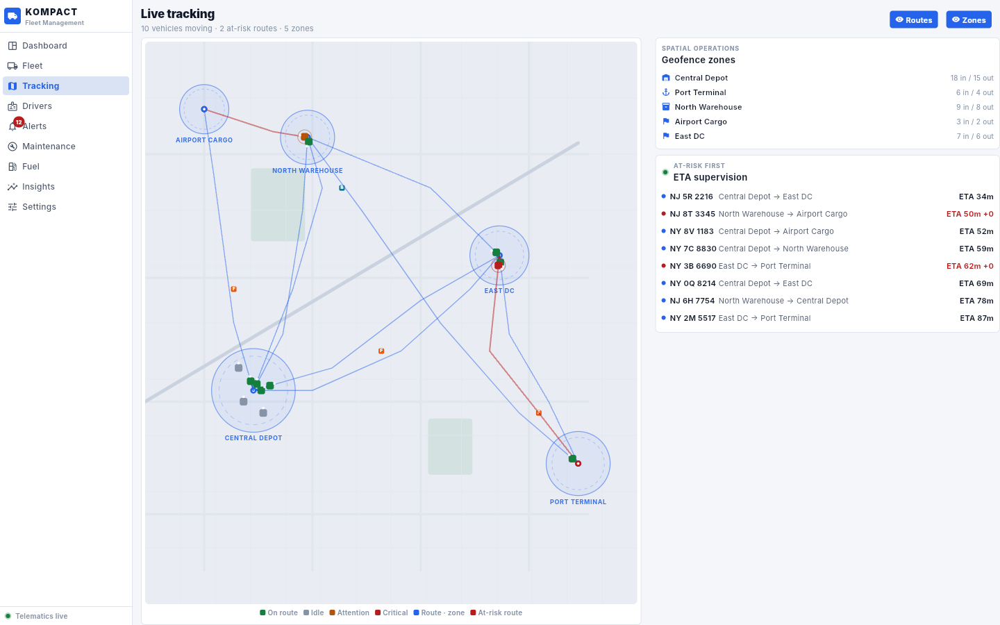 |
| **Fleet + vehicle telemetry** | **Alert center** |
| 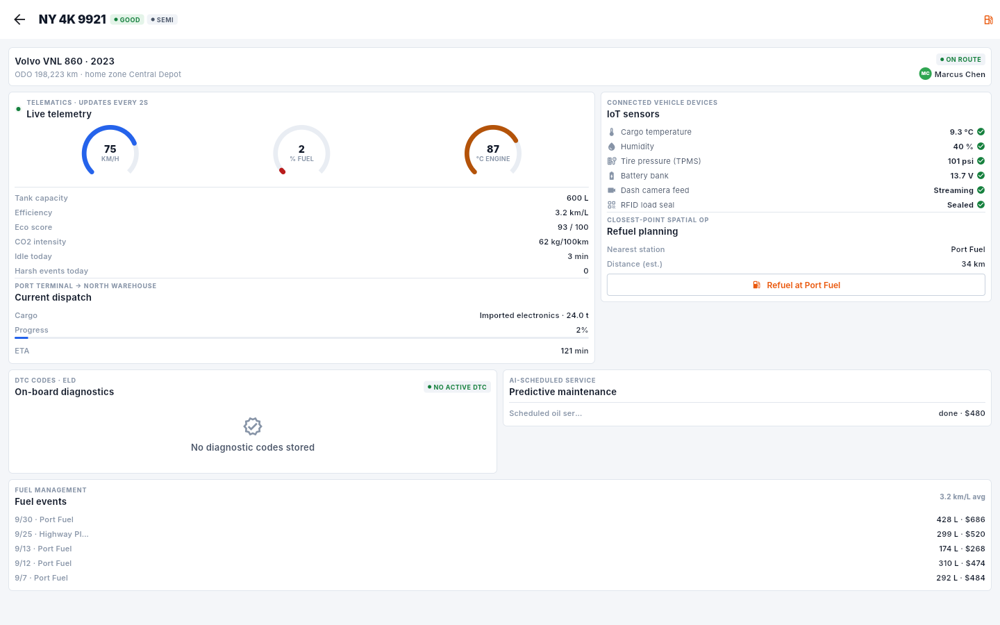 | 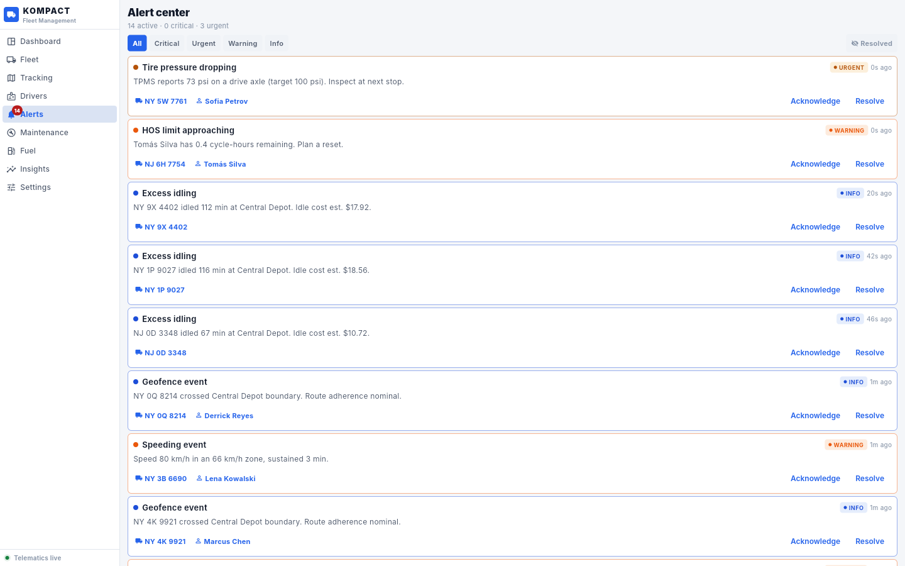 |

<details>
<summary>More (drivers, maintenance, fuel, insights, settings, dark, mobile)</summary>

| Drivers | Maintenance |
|---|---|
| 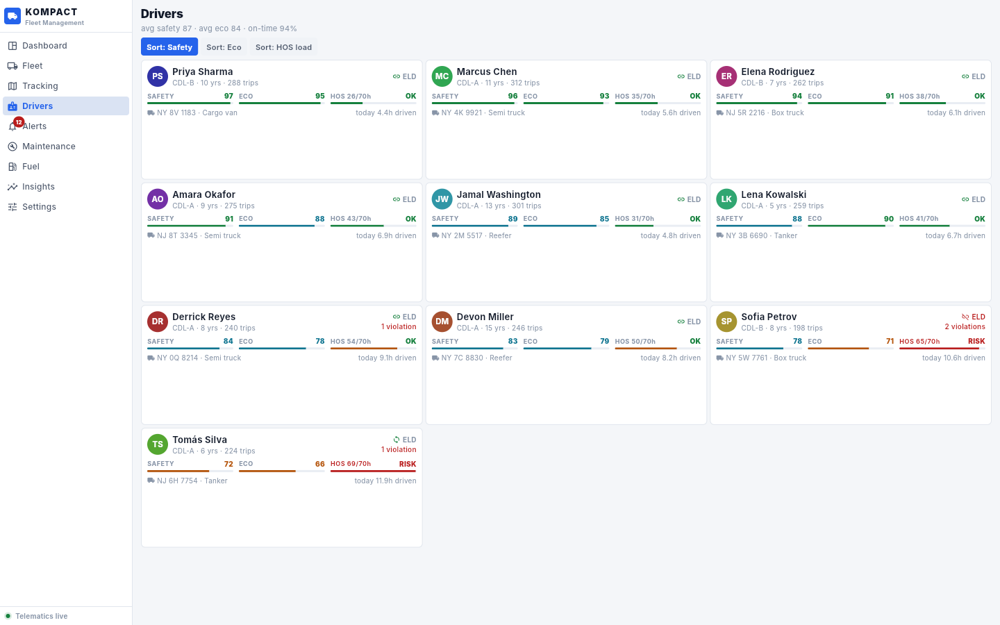 | 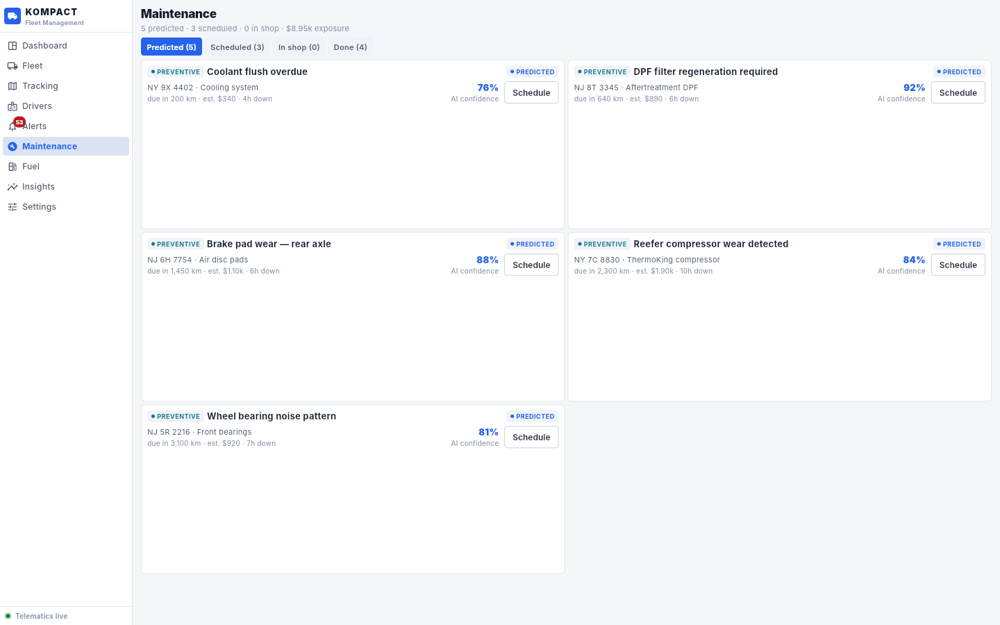 |
| **Fuel** | **Insights** |
| 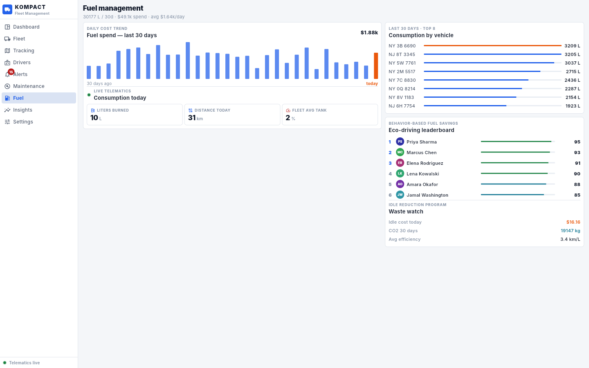 | 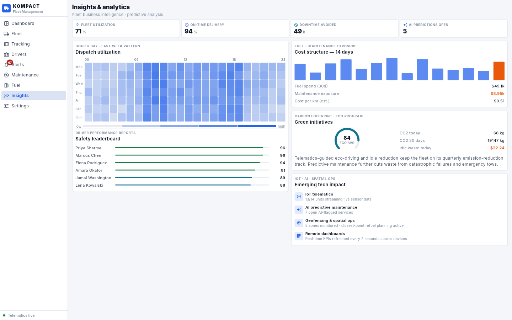 |
| **Dark** | **Mobile** |
| 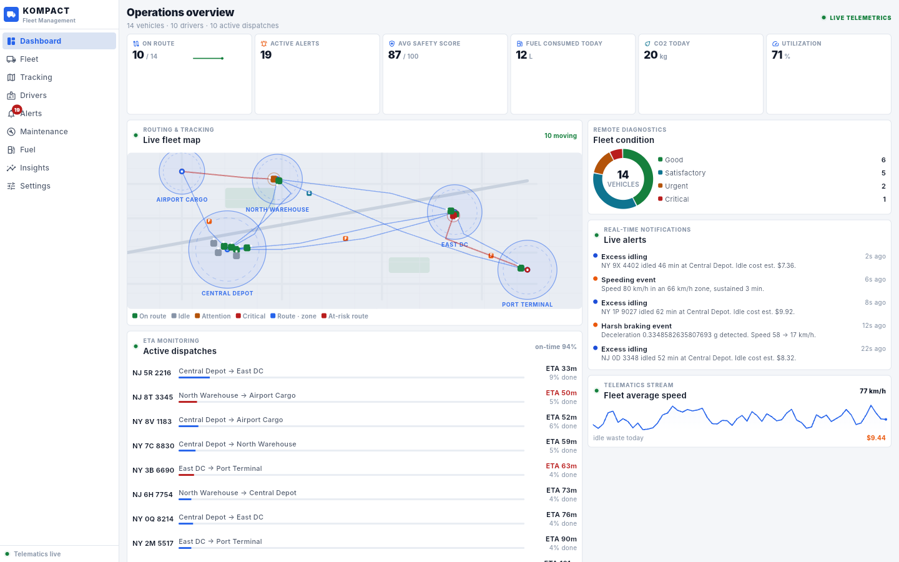 | 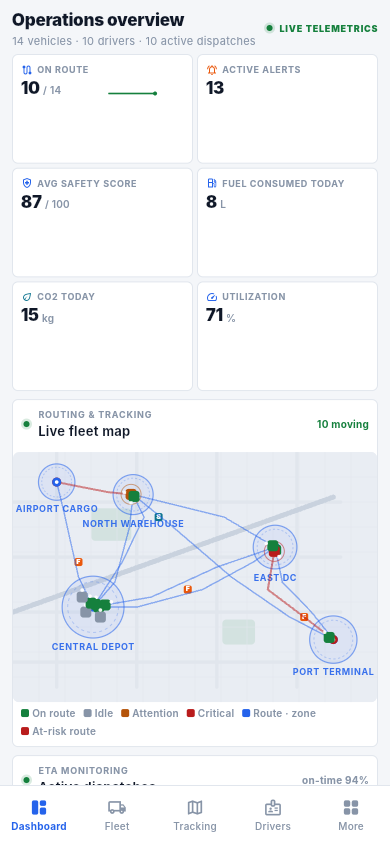 |
</details>

## Features

- **7 role dashboards** — every persona (ops, dispatcher, driver, maintenance, safety, finance, executive) gets a dedicated board over the same live data; role-filtered navigation keeps each workspace focused
- **Dashboard (Ops)** — live KPIs (on-route, alerts, safety, fuel, CO2, utilization), condition donut, real-time alert feed, active dispatches with ETAs, fleet speed stream
- **Fleet** — dense inventory grid with status/type filters; per-vehicle detail with **live telemetry gauges** (speed, fuel, engine temp), **IoT sensor panel** (cargo temp, humidity, TPMS, battery, camera, RFID), DTC diagnostics, predictive service, fuel history, refuel planning via closest-point
- **Live tracking** — custom-painted city map: moving vehicle markers with heading, geofence zones, station landmarks, traveled-route rendering, at-risk highlighting, ETA supervision
- **Drivers** — safety/eco/HOS scorecards, ELD status, behavior (harsh braking/accel, speeding, seatbelt), violations & fines, performance reports
- **Alerts** — severity feed with acknowledge/resolve workflow, **SOS roadside-assistance dispatch**, collision reports with facts (impact speed, airbags, video)
- **Maintenance** — corrective vs preventive pipeline, **AI-flagged predictions with confidence %**, schedule/start/complete actions, downtime & cost exposure
- **Fuel** — 30-day spend trend, per-vehicle consumption ranking, eco-driving leaderboard, idle-waste watch
- **Insights** — hour×day utilization heatmap, safety leaderboard, cost structure, green-initiative tracker, emerging-tech impact
- **Live simulation** — a 2-second telematics tick moves vehicles along routes, burns fuel, accumulates HOS and raises real-time alerts (pause / 0.5–4× speed in Settings)
- **Persistence** — everything stored locally via `shared_preferences` (works on all 6 targets)
- **No heavy dependencies** — map and all charts are custom-painted; deps are just `provider` + `shared_preferences`

## Download

Grab the latest build from **[Releases](https://github.com/L3von36/kompact/releases)** —
every push to `main` rebuilds all six targets automatically via GitHub Actions.

| Artifact | Platform | How to run |
|---|---|---|
| `*-android-universal.apk` | Android | Sideload directly (debug-signed for sideloading) |
| `*-android-play.aab` | Android | Play Store bundle |
| `*-ios-unsigned.ipa` | iOS | Re-sign with your certificate (Xcode / AltStore / Sideloadly) |
| `*-linux-x64.zip` | Linux | Unzip → `bundle/kompact` |
| `*-windows-x64.zip` | Windows | Unzip → run `kompact.exe` |
| `*-macos.zip` | macOS | Unzip → right-click → **Open** (unsigned; or `xattr -cr kompact.app`) |
| `*-web.zip` | Any | Host anywhere, or use the Pages link below |

🌐 **Try it live on the web:** https://l3von36.github.io/kompact/

> **iOS note:** Apple requires signed builds; the CI produces an *unsigned* IPA.
> Open it in Xcode with your own signing identity, or sideload via AltStore/Sideloadly.

## CI/CD

`.github/workflows/release.yml` runs on every push to `main`:

```
quality (analyze + test)
  ├── android  (ubuntu)  → universal APK + Play AAB
  ├── ios      (macos)   → unsigned IPA
  ├── linux    (ubuntu)  → x64 bundle zip
  ├── windows  (windows) → x64 zip
  ├── macos    (macos)   → .app zip (ditto, symlinks preserved)
  └── web      (ubuntu)  → zip + GitHub Pages deploy
        └── release → all artifacts attached to a versioned GitHub Release
```

## Develop locally

```bash
flutter pub get
flutter run            # connected device / desktop / chrome
flutter test           # widget tests
flutter build apk --release
```

Requires Flutter 3.47.x stable. Desktop builds need the usual platform toolchains
(Visual Studio on Windows, Xcode on macOS, `libgtk-3-dev ninja-build` on Linux).

## Project structure

```
lib/
├── main.dart               # entry point (+ ?role= deep link)
├── app.dart                # MaterialApp + role-filtered adaptive shell
├── core/
│   ├── models.dart         # Vehicle / Driver / Trip / Alert / Maintenance / FleetRole…
│   ├── fleet_state.dart    # live telematics simulation + persistence + role state
│   ├── theme.dart          # Kompact compact design system (K tokens, light/dark)
│   └── seed.dart           # seeded demo fleet (14 vehicles, 10 drivers, dispatches…)
├── ui/
│   ├── adaptive_scaffold.dart  # rail (wide) ↔ bottom bar + More (narrow);
│   │                           # identity card, grouped sections, badges, live strip
│   ├── role_picker.dart    # workspace switcher (dialog/sheet) + RoleSwitchChip
│   ├── widgets.dart        # cards, chips, KPI tiles, gauges rows, fact grids…
│   ├── charts.dart         # custom-painted sparkline, bars, donut, gauge, heatmap
│   └── map_painter.dart    # live city map: roads, geofences, routes, vehicles
└── screens/
    ├── dashboard_screen.dart   # role router
    ├── dashboards/             # 7 role workspaces
    │   ├── ops_dashboard.dart  ├── dispatcher_dashboard.dart
    │   ├── driver_dashboard.dart  ├── maintenance_dashboard.dart
    │   ├── safety_dashboard.dart  ├── finance_dashboard.dart
    │   └── exec_dashboard.dart
    └── fleet, tracking, drivers, alerts, maintenance, fuel, insights, settings
```

## License

MIT — see [LICENSE](LICENSE). Inter font is licensed under the SIL Open Font License
(see `assets/fonts/LICENSE.txt`).
