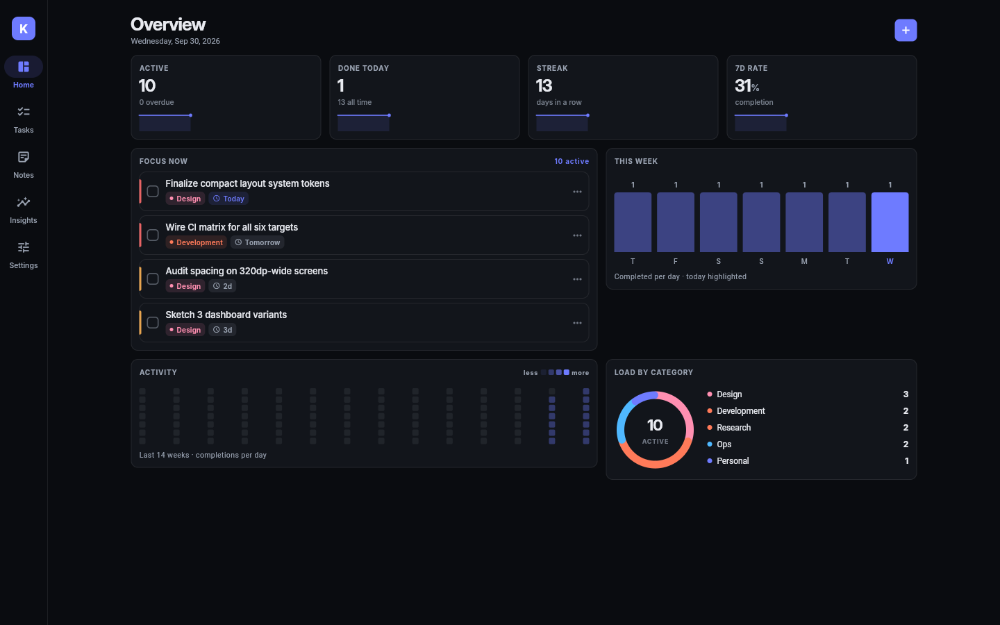
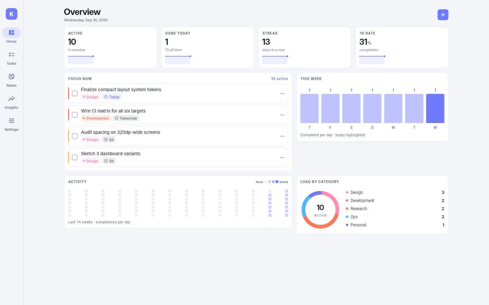
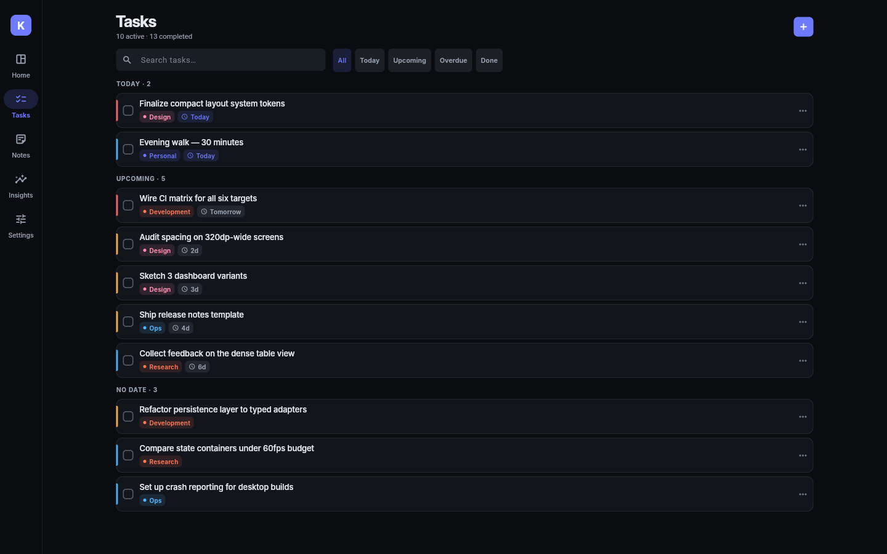
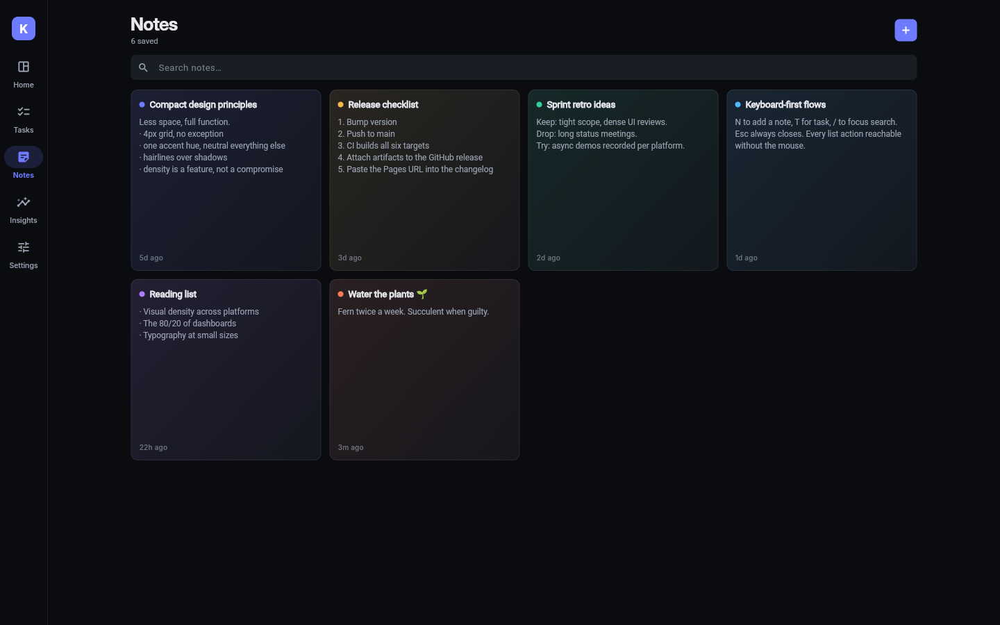
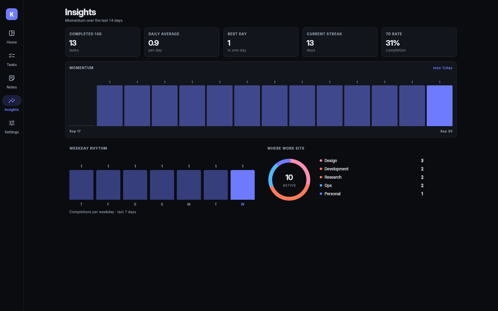
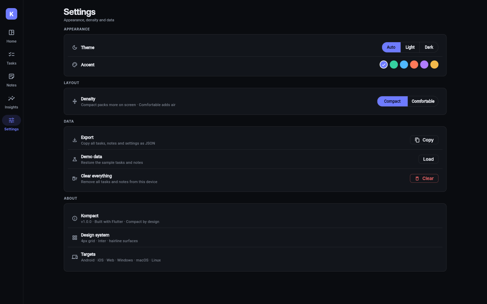
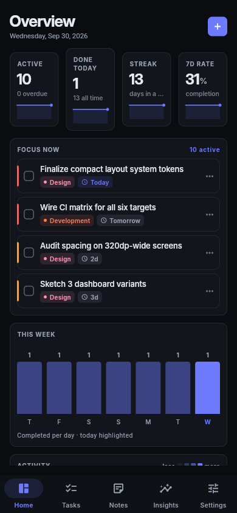

<p align="center">
  
</p>

<h1 align="center">Kompact</h1>

<p align="center">
  <strong>A compact-design productivity suite.</strong><br>
  Full functionality in minimal space — built with Flutter for 6 targets from one codebase.
</p>

<p align="center">
  <a href="https://github.com/L3von36/kompact/actions/workflows/release.yml"></a>
  <a href="https://github.com/L3von36/kompact/releases"></a>
  
  
</p>

---

## The compact design system

Kompact is a demonstration of **compact design done right** — systems that use less
physical space while keeping full functionality:

| Principle | Implementation |
|---|---|
| **4px micro-grid** | All spacing snaps to 4 / 8 / 12 / 16 / 24 |
| **Tight type scale** | Inter: body 13px, captions 11px, uppercase 10px micro-labels |
| **Hairline over shadow** | 1px borders instead of elevation — calmer, denser surfaces |
| **One accent hue** | 6 switchable accents; everything else stays neutral |
| **Density as a feature** | `VisualDensity.compact` + 34px controls (toggleable to comfortable) |
| **Adaptive shell** | 68px icon rail on desktop → slim bottom bar on phones |
| **Info-per-pixel** | KPI cards, sparklines, heatmap strip, donut charts — zero dead space |

## Screenshots

| Dashboard | Tasks |
|---|---|
|  |  |
| **Notes** | **Insights** |
|  |  |

<details>
<summary>More (Settings, mobile, dark)</summary>

| Settings | Mobile |
|---|---|
|  |  |
</details>

## Features

- **Dashboard** — animated KPI counters, 14-week activity heatmap, weekly bars, category donut, focus list
- **Tasks** — full CRUD, priorities, categories, due dates, search, 5 filters, smart grouping, undo on delete
- **Notes** — color-tinted quick notes with search and editing
- **Insights** — 14-day momentum, weekday rhythm, category load, streaks and rates
- **Settings** — theme mode, 6 accents, density control, JSON export, demo data, wipe
- **Persistence** — everything stored locally via `shared_preferences` (works on all 6 targets)
- **No heavy dependencies** — charts are custom-painted; deps are just `provider` + `shared_preferences`

## Download

Grab the latest build from **[Releases](https://github.com/L3von36/kompact/releases)** —
every push to `main` rebuilds all six targets automatically via GitHub Actions.

| Artifact | Platform | How to run |
|---|---|---|
| `*-android-universal.apk` | Android | Sideload directly (debug-signed for sideloading) |
| `*-android-play.aab` | Android | Play Store bundle |
| `*-ios-unsigned.ipa` | iOS | Re-sign with your certificate (Xcode / AltStore / Sideloadly) |
| `*-linux-x64.zip` | Linux | Unzip → `bundle/kompact` |
| `*-windows-x64.zip` | Windows | Unzip → run `kompact.exe` |
| `*-macos.zip` | macOS | Unzip → right-click → **Open** (unsigned; or `xattr -cr kompact.app`) |
| `*-web.zip` | Any | Host anywhere, or use the Pages link below |

🌐 **Try it live on the web:** https://l3von36.github.io/kompact/

> **iOS note:** Apple requires signed builds; the CI produces an *unsigned* IPA.
> Open it in Xcode with your own signing identity, or sideload via AltStore/Sideloadly.

## CI/CD

`.github/workflows/release.yml` runs on every push to `main`:

```
quality (analyze + test)
  ├── android  (ubuntu)  → universal APK + Play AAB
  ├── ios      (macos)   → unsigned IPA
  ├── linux    (ubuntu)  → x64 bundle zip
  ├── windows  (windows) → x64 zip
  ├── macos    (macos)   → .app zip (ditto, symlinks preserved)
  └── web      (ubuntu)  → zip + GitHub Pages deploy
        └── release → all artifacts attached to a versioned GitHub Release
```

## Develop locally

```bash
flutter pub get
flutter run            # connected device / desktop / chrome
flutter test           # widget tests
flutter build apk --release
```

Requires Flutter 3.47.x stable. Desktop builds need the usual platform toolchains
(Visual Studio on Windows, Xcode on macOS, `libgtk-3-dev ninja-build` on Linux).

## Project structure

```
lib/
├── main.dart               # entry point
├── app.dart                # MaterialApp + adaptive shell
├── core/
│   ├── models.dart         # Task / Note / AppSettings + JSON
│   ├── app_state.dart      # ChangeNotifier store + persistence + stats
│   ├── theme.dart          # compact design system (K tokens)
│   └── seed.dart           # first-run demo content
├── ui/
│   ├── adaptive_scaffold.dart  # rail (wide) ↔ bottom bar (narrow)
│   ├── widgets.dart        # cards, chips, counters, headers…
│   ├── charts.dart         # custom-painted bars, donut, sparkline, heatmap
│   └── task_widgets.dart   # task tile + editor dialog
└── screens/                # dashboard, tasks, notes, insights, settings
```

## License

MIT — see [LICENSE](LICENSE). Inter font is licensed under the SIL Open Font License
(see `assets/fonts/LICENSE.txt`).
